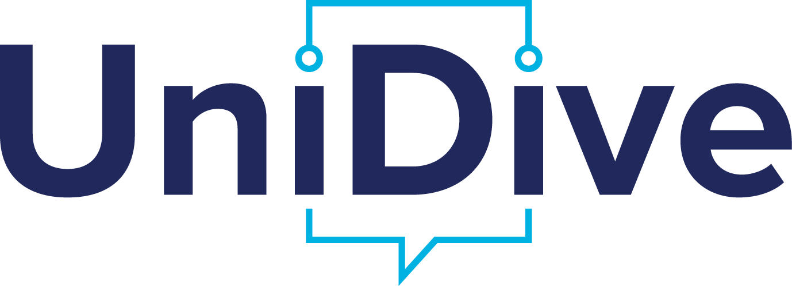
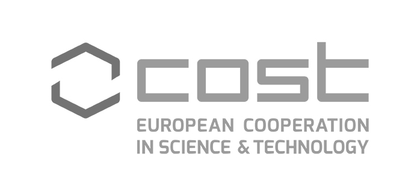

# 2nd Workshop on Universal Dependencies for Turkic Languages

As a follow-up to the [2023 workshop in Istanbul](https://ud-turkic.github.io/udtw23/), this workshop aims to bring together researchers working on [Universal Dependencies](http://universaldependencies.github.io/docs/) (UD) treebanks for [Turkic languages](https://en.wikipedia.org/wiki/Turkic_languages).

The workshop will be held in a hybrid format as a half-day session at [SyntaxFest 2025](https://syntaxfest.github.io/syntaxfest25/) in Ljubljana on August 26, 2025. We will also facilitate online participation.

## Linguistic Fields & Languages

**Linguistic Field(s):**  

- Computational Linguistics
- General Linguistics
- Text/Corpus Linguistics

**Subject Language(s):**  

- Azerbaijani (aze)
- Kazakh (kaz)
- Kirghiz (kir)
- Turkish (tur)
- Uzbek (uzb)

**Language Family:** Turkic

## Call for Abstracts

We invite submissions for short presentations (10 minutes) on topics concerning UD Turkic treebanks. The maintainers of existing treebanks, as well as those in the process of developing new ones, are strongly encouraged to present their work and discuss interesting or challenging annotation cases.

If you are interested in participating in person and presenting your research in this workshop, please submit a short abstract (100 to 200 words) of your talk through the registration form (below) by **June 10, 2025**. 

The abstract should provide brief information about the treebank that you are maintaining or building, as well as the issues you would like to discuss in your presentation. Abstracts on other topics concerning the UD Turkic treebanks are also welcome.

## Focus Areas

The primary focus of the workshop will be on _consistent_ annotations of several phenomena that have been discussed in the community since the Istanbul meeting, particularly:

- The annotation of the "-ki suffix"
- Copular constructions, for which concrete proposals have been produced by community members

We are also interested in exploring other linguistic phenomena in Turkic languages that present challenges for annotation within the current [UD guidelines](https://universaldependencies.org/guidelines.html).

## Additional Topics

We welcome contributions on:

- New treebanks for Turkic languages
- Linguistic research conducted using the treebanks
- Applications of treebanks for research and practical purposes

## Program

TBD

## Registration

If you are interested in participating in the 2nd Workshop on Universal Dependencies for Turkic Languages, please complete the [registration form](https://forms.gle/VB9fBKDMrJdRucA16) by **June 10, 2025**.

## Organizers

- Bermet Chontaeva, [University of Tübingen](https://uni-tuebingen.de/en/)
- Soudabeh Eslami, [University of Tübingen](https://uni-tuebingen.de/en/)
- Arofat Akhundjanova
- [Nikolett Mus](https://nytud.hu/en/colleague/nikolett-mus/profile), [Institute for Historical and Uralic Linguistics](https://nytud.hu/en)
- [Furkan Akkurt](https://furkanakkurt1335.github.io/), [Boğaziçi University](https://bogazici.edu.tr/)
- [Çağrı Çöltekin](http://coltekin.net/cagri/), [University of Tübingen](https://uni-tuebingen.de/en/) (Workshop Chair)

Contact point for questions / help: <tt>[udtw-organisers@googlegroups.com](mailto:udtw-organisers@googlegroups.com)</tt>

## Support

This workshop is co-organized by [COST action CA21167](https://www.cost.eu/actions/CA21167/): Universality, diversity and idiosyncrasy in language technology ([UniDive](https://unidive.lisn.upsaclay.fr/)).

A limited number of participants may qualify for travel reimbursement and daily allowances (Daily allowance: 160 EUR) provided by the UniDive COST Action.

  
  
  

